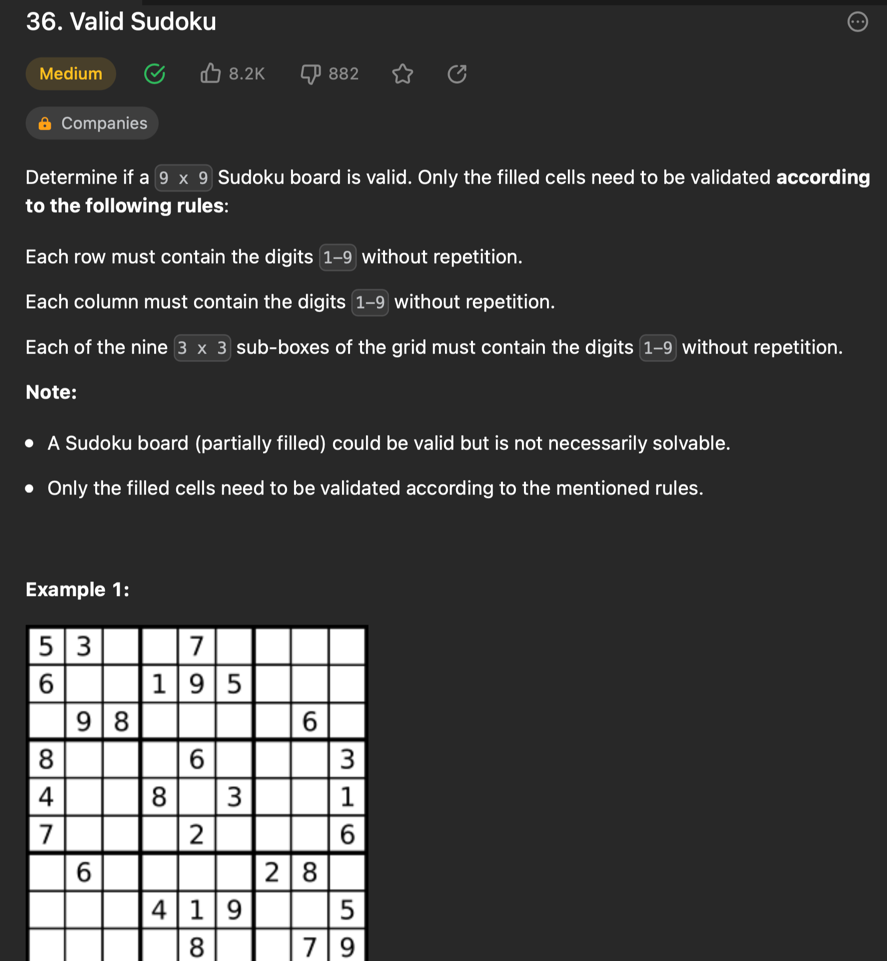
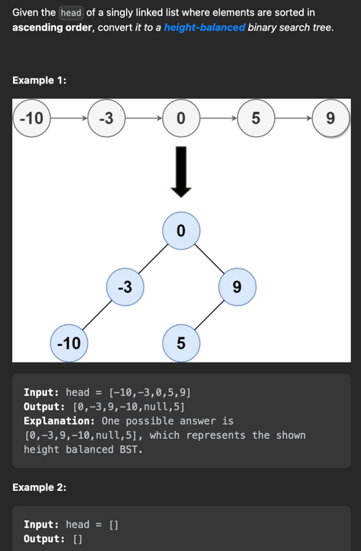
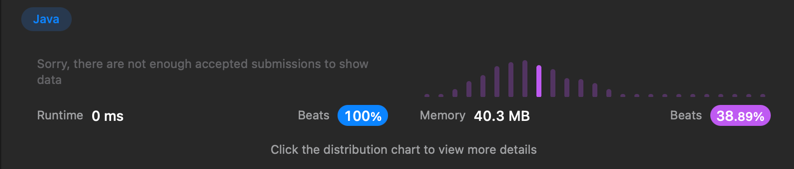

# 36.Valid Sudoku
https://leetcode.com/problems/valid-sudoku/

## 문제

## 풀이

## 속도

- n2(엔제곱)의 속도를 가진다고 생각함. 더 빠른 속도로 풀 수는 없을까?  
- Set은 중복제거의 성질이 있어서 리스트보다 속도가 훨씬 빠른 자료구조라고 알고있는데환경을 감안해도 런타임이 너무 느림.

### HashSet이란?
- 객체를 중복해서 저장할 수 없으며 하나의 null값만 저장가능.(중복 자동 제거) 
- 저장순서 유지 불가
- 중복을 걸러내는 과정
  - 내부적으로 HashMap을 호출하여 구현
  - 데이터 저장전 hasCode()메소드를 통해 같은 해시코드가 있는지 확인. 있다면 equals()메소드로 중복을 검사한다. 

