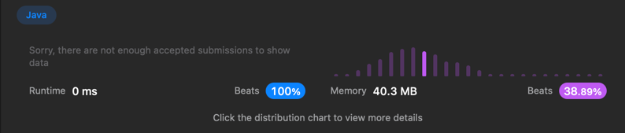

## 225. Implement Stack using Queues


```java
class MyStack {
    Queue<Integer>q1;
    Queue<Integer>q2;
    public MyStack() {
        q1=new ArrayDeque<>();
        q2=new ArrayDeque<>();
    }
    
    public void push(int x) {
        while(!q1.isEmpty()){
            q2.offer(q1.poll());
            
        }
        q1.offer(x);
        while(!q2.isEmpty()){
            q1.offer(q2.poll());
        }
    }
    
    public int pop() {
        return q1.poll();
    }
    
    public int top() {
        return q1.peek();
    }
    
    public boolean empty() {
        if(q1.isEmpty()){
            return true;
        }
        return false;
    }
}
```



push는 풀이를 보고 품. 
왜 두개를 쓰는지 모르겠고   

```java
public void push(int x) {
    while(!q1.isEmpty()){
    q2.offer(q1.poll());
        }
        q1.offer(x);
        while(!q2.isEmpty()){
            q1.offer(q2.poll());
        }
    }
```
는 보고 풀었습니다.

