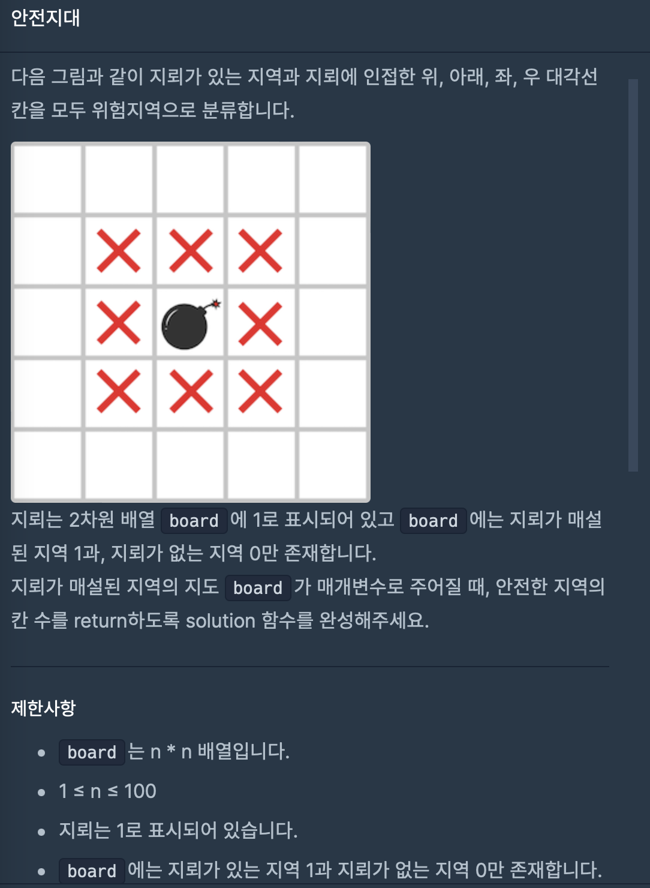
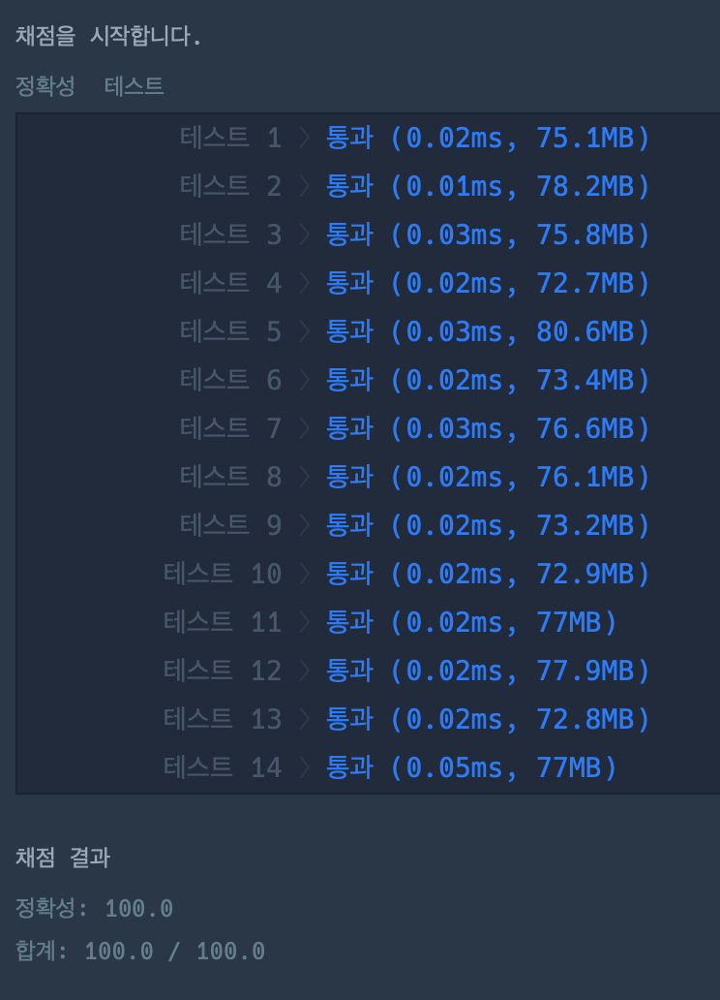

## 프로그래머스 안전지대 문제 

### 문제


###코드
```java
class soulution{
    public int solution(int[][] board) {
        int answer = 0;
        for(int i = 0; i<board.length;i++){
            for (int j=0;j<board.length;j++){
                int ij = board[i][j];
                if(ij == 1){
                    changNum(board,i-1,j-1);
                    changNum(board,i-1,j);
                    changNum(board,i-1,j+1);
                    changNum(board,i,j-1);
                    changNum(board,i,j+1);
                    changNum(board,i+1,j-1);
                    changNum(board,i+1,j);
                    changNum(board,i+1,j+1);
                }
            }
        }

        for(int k = 0; k<board.length;k++){
            for (int f=0;f<board.length;f++){
                int kf = board[k][f];
                if(kf == 0){
                    answer += 1;
                }
            }
        }
        return answer;
    }

    public void changNum(int[][]board,int i,int j){
        if(i>=0&&i<board.length&&j>=0&&j<board.length){
            if(board[i][j]==0){
                board[i][j]=3;
            }
        }
    }
}
```
### 결과
